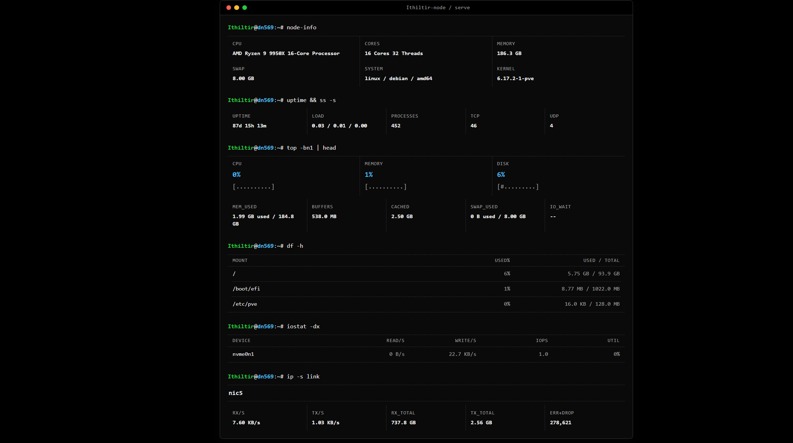

# Ithiltir-node

[中文](README_CN.md)

Node metrics agent with two modes:

- `local`: expose the local page and local APIs
- `push`: post reports to a dashboard and keep a local cached report

## Modes

### Local



```bash
./node
./node local [listen_ip] [listen_port] [--net iface1,iface2] [--debug]
```

- Default listen: `0.0.0.0:9100`
- Env override: `NODE_HOST`, `NODE_PORT`
- Page: `GET /` or `GET /local`
- Metrics endpoint: `GET /metrics`
- Static hardware endpoint: `GET /static`
- Page override: set `ITHILTIR_NODE_LOCAL_PAGE_DIR`, or place `localpage/` next to the binary; public assets live under `localpage/assets/`

### Push

```bash
./node push [interval_seconds] [--net iface1,iface2] [--debug] [--require-https]
```

- Report targets are read from `/var/lib/ithiltir-node/report.yaml` on Linux/macOS and `%ProgramData%\Ithiltir-node\report.yaml` on Windows
- Override the config path with `ITHILTIR_NODE_REPORT_CONFIG`
- Each target URL is the dashboard metrics endpoint and receives `X-Node-Secret: <key>`
- If a target URL ends with `/metrics`, static metadata is posted to the sibling `/static` URL
- Debug local endpoint: `GET http://127.0.0.1:${NODE_PORT:-9101}/`
- HTTPS targets can fall back to HTTP unless `--require-https` is set

Report target commands:

```bash
./node report install <url> <key>
./node report remove <id>
./node report update <id> <key>
./node report list
```

Use `report install` from install scripts. The URL must point at the dashboard `/metrics` endpoint. The command reads the dashboard server identity before writing `report.yaml`; rerunning the same install is a no-op, and a different target with the same `server_install_id` prompts which one to keep.
Use `report update` only to rotate an existing target key; URL changes go through `report install`.
The config file keeps `version` and `targets`; each target has `id`, `url`, `key`, and optional `server_install_id`.
Writes are atomic and keep file mode `0600`.

### Windows Runner

```powershell
.\ithiltir-runner.exe [node args...]
```

- Windows only; no args defaults to `push`
- Supervises `%ProgramData%\Ithiltir-node\bin\ithiltir-node.exe` and uses `%ProgramData%\Ithiltir-node` as the working directory
- Enables staged node updates from dashboard metrics responses on Windows

### Self Update

- Windows updates require the runner (`ITHILTIR_NODE_RUNNER=1`) and replace `%ProgramData%\Ithiltir-node\bin\ithiltir-node.exe`
- Linux and macOS updates work only from the installed release layout under `/var/lib/ithiltir-node/releases`; the node downloads the new binary, switches `/var/lib/ithiltir-node/current`, then execs the updated node with the same args and environment
- Update asset downloads send the current target key as `X-Node-Secret`; keep keys out of URLs and query strings
- Direct binaries outside the installed layout do not apply update manifests; the push loop reports self update as disabled and keeps running

### Version

```bash
./node --version
./node -v
```

## PVE VM monitoring

The ordinary node optionally reads a root-owned cache; there is no separate virtualization node variant. Appending `--pve` to a Linux install command installs the precompiled `pve-cache` helper and systemd service through Dash. Node stays unprivileged. The Dash package must include matching helpers; no local compiler, PVE user or API token is needed.

For manual deployment, install the helper outside the node-writable release tree, prepare root-owned `/run/ithiltir-node` readable by the runtime group, and run `pve-cache --serve --group ithiltir` as a root service. It owns basic metrics, slow IP collection and the local query socket. One-shot and `--guest` modes remain available for manual collection. Set `ITHILTIR_NODE_VIRT_CACHE=/run/ithiltir-node/virt.json` for `node push` to enable independent VM reporting. Unset means no cache reads or VM delivery tasks. `pve-cache --version` reports the node release version. Node self-update never replaces the root-owned helper.

The helper reads local QEMU VM status and supplements CPU ratios with PVE resource statistics. Disk/network bytes are cumulative counters; unavailable metrics remain absent. Failed collection preserves the last successful observations/time. LXC, VM history, HA configuration and VM controls are not included. See [reporting API](docs/reporting_apis.md#virtual-machine-snapshots).

Guest Agent IPs are returned in optional `ips` arrays, up to 128 unique IPv4/IPv6 addresses per VM, including private addresses and excluding loopback, link-local, unspecified, multicast and invalid addresses. PVE must enable the guest agent and the agent must be running inside the VM. Missing IPs do not fail basic collection. IP collection runs independently inside `pve-cache --serve` (manual one-shot: `--guest`): the scheduler wakes 60 seconds after completion, successful VMs wait five minutes, and failures back off for 5, 10, 20, then 30 minutes (maximum). Only running, non-template, non-paused VMs from a fresh inventory are queried. Four workers use five-second query deadlines within a 50-second slow-collection budget. Per-VM file locks are inherited by query processes; timeout kills the process group and waits for exit. A still-running query blocks any replacement for that VM. Cooldowns are saved before launch in root-only `/run/ithiltir-node/pve-guest`; this state is volatile and resets on reboot. Hot collection only reads this cache.

## Build

Linux builds also produce `linux/pve_cache_linux_amd64` and `linux/pve_cache_linux_arm64`. Release assets are named `Ithiltir-pve-cache-linux-amd64` and `Ithiltir-pve-cache-linux-arm64`; they share the node version and checksum file.

Build config lives in [`.goreleaser.yaml`](.goreleaser.yaml).

Version format:

```text
MAJOR.MINOR.PATCH[-PRERELEASE][+BUILD]
```

- Strict SemVer, without a `v` prefix.
- Normal releases are only `x.x.x` or `x.x.x+build`.
- Any version with a pre-release part such as `x.x.x-rc.1` or `x.x.x-rc.1+build` is a GitHub pre-release.
- CI rejects invalid SemVer tags before publishing.

Linux/macOS:

```bash
./scripts/build.sh --version 1.2.3-alpha.1
./scripts/build.sh --use-git-tag
./scripts/build.sh --use-git-tag --release
```

Windows:

```powershell
.\scripts\build.ps1 -Version 1.2.3-alpha.1
.\scripts\build.ps1 -UseGitTag
.\scripts\build.ps1 -UseGitTag -Release
```

- Output directory:

```text
build/
  linux/
    node_linux_amd64
    node_linux_arm64
  macos/
    node_macos_arm64
  windows/
    node_windows_amd64.exe
    node_windows_arm64.exe
    runner_windows_amd64.exe
    runner_windows_arm64.exe
```

- GitHub Release title is the version tag. Node assets are plain binaries named `Ithiltir-node-<os>-<arch>`; Windows runner assets are named `Ithiltir-runner-windows-<arch>`. Windows keeps `.exe`, and checksums are uploaded separately
- The scripts install GoReleaser `v2.17.1` if it is missing

## Docs

- Reporting API: [English](docs/reporting_apis.md), [中文](docs/reporting_apis_CN.md)
- Local page API: [English](docs/local_page_api.md), [中文](docs/local_page_api_CN.md)
- Disk schema: [English](docs/api_disk.md), [中文](docs/api_disk_CN.md)

## Layout

```text
cmd/node         entry point
cmd/runner       Windows runner entry point
internal/app     mode dispatch and lifecycle
internal/cli     flag parsing
internal/collect samplers and platform collectors
internal/metrics runtime and static JSON types
internal/push    push client
internal/reportcfg report target config
internal/runner  Windows runner supervisor
internal/selfupdate staged update support
internal/server  HTTP handlers
scripts/         build scripts
build/           generated artifacts
```

## License

Ithiltir-node is licensed under the GNU Affero General Public License v3.0 only. See [LICENSE](LICENSE).


## Node gRPC transport

HTTP remains the default for compatibility. Set `ITHILTIR_NODE_TRANSPORT=grpc` (RPC only) or `auto` (negotiate before reports) in the Node service environment, then restart Node. Dash serves gRPC on its existing HTTP/2 listener; proxies must forward `/ithiltir.node.v1.Node/` with gRPC support. These modes never authorize plaintext fallback after authentication or TLS failures. PVE history also requires the root helper service (`pve-cache --serve`). Browser APIs and asset downloads remain HTTP.
